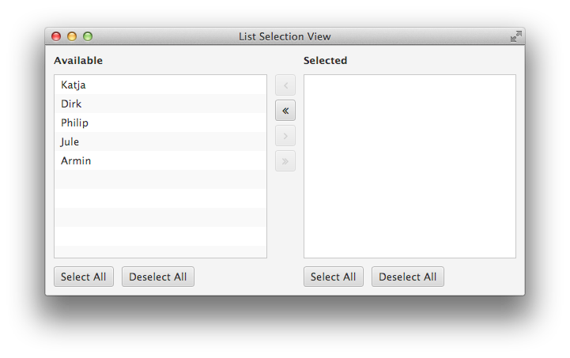
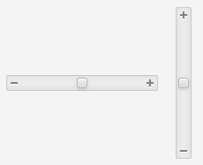
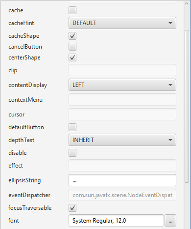
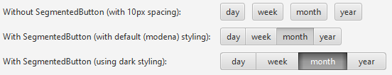

# ControlsFX Features

[ControlsFX](http://www.controlsfx.org/) is a library of UI controls and useful API for JavaFX 8.0 and beyond. What follows is a list of **some** of the features included in ControlsFX (although there are far more features than just what is shown below!). As always, the best place to learn about all the features of ControlsFX is in the [JavaDocs](http://docs.controlsfx.org/) – these have been the subject of way too much attention and they contain a wealth of information in them.

Please click on the feature for more details and a link to the relevant javadoc pages! Note that some links go to a new page, whilst the simpler controls are shown on this page.

* [Actions](#actions)
* [Borders](#borders)
* [BreadcrumbBar](#breadcrumbbar)
* [ButtonBar](#buttonbar)
* [CheckComboBox / CheckListView / CheckTreeView](#checked)
* [Decoration / Validation](#decorationvalidation)
* [Dialogs](http://fxexperience.com/controlsfx/features/dialogs/)
* [FXSampler](#fxsampler)
* [Glyph font pack support](#glyph)
* [GridView](#gridview)
* [HiddenSidesPane](#hiddensidespane)
* [HyperlinkLabel](#hyperlinklabel)
* [InfoOverlay](#infooverlay)
* [ListSelectionView](#listselectionview)
* [MasterDetailPane](#masterdetailpane)
* [Notifications / NotificationPane](#notifications)
* [PlusMinusSlider](#plusminusslider)
* [PopOver](#popover)
* [PropertySheet](#propertysheet)
* [RangeSlider](#rangeslider)
* [Rating](#rating)
* [SegmentedButton](#segmentedbutton)
* [SnapshotView](#snapshotview)
* [SpreadsheetView](#spreadsheetview)
* [TaskProgressView](#taskprogressview)
* [TextFields](#textfields)
* [Top Quality JavaDocs!](#javadocs)
* [Translations](#translations)

## <a id="actions"></a>Actions API
The [Actions](http://docs.controlsfx.org/org/controlsfx/control/action/Action.html) API is used by both the dialogs API and the ButtonBar API. It essentially abstracts away the notion of how a control is represented, instead focusing on the properties of the control (e.g. text, graphic, etc). This makes it really easy to reuse the same Action in multiple places in your UI. We’ve also developed convenience API to convert Actions into the common UI controls (see the ActionUtils class for these methods). In recent releases, we’ve built on to the Actions API to include functionality such as:

*   An [ActionProxy annotation](http://controlsfx.bitbucket.org/index.html?org/controlsfx/control/action/ActionProxy.html) (to create actions directly by annotating methods) which can be discovered at runtime using the [ActionMap](http://controlsfx.bitbucket.org/index.html?org/controlsfx/control/action/ActionMap.html) class.
*   Support for [ActionTraits](http://controlsfx.bitbucket.org/index.html?org/controlsfx/dialog/Dialog.ActionTrait.html) to more cleanly specify the functionality of actions when used in dialogs.
*   [ActionTextBehavior](http://controlsfx.bitbucket.org/index.html?org/controlsfx/control/action/ActionUtils.ActionTextBehavior.html) to more easily specify what text is shown in UI controls when built from an action.

## <a id="border"></a>Borders
The Borders API is a simple (and still relatively exploratory) API that allows you to easily wrap panes or nodes with a border, in a similar fashion to the Swing BorderFactory API. Here’s a some code, and then a screenshot of what that code results in:

``` java
Node wrappedButton = Borders.wrap(button)
.lineBorder().color(Color.RED).build()
.lineBorder().color(Color.GREEN).build()
.build();
```


A single button with two borders.

## <a id="breadcrumbbar"></a>BreadCrumbBar
The BreadCrumbBar control is designed to allow people to easily navigate back up a hierarchical page structure. It’s based on the same API as the TreeView control (that is, it uses the TreeItem structure). This control is useful to visualize and navigate a hierarchical path structure, such as file system. Here’s what it currently looks like:


The BreadCrumbBar UI control

## <a id="buttonbar"></a>ButtonBar  
[ButtonBar](http://docs.controlsfx.org/org/controlsfx/control/ButtonBar.html) is a horizontal container for buttons, which automatically places the buttons in the correct position for the underlying operating system. Just annotate the buttons with their type and it’ll handle the rest!


## <a id="checked"></a>CheckComboBox / CheckListView / CheckTreeView
All three controls offer the same functionality – support for checking zero or more items in a ComboBox, ListView, or a TreeView, and being able to easily retrieve the checked items from an underlying ‘check model’. These were already easily doable using standard JavaFX APIs, but this takes it a step further by automatically tracking the checkbox selections for you. Here’s a screenshot of each of the new controls:


CheckComboBox, CheckListView, and CheckTreeView

## <a id="fxsampler"></a>ControlsFX sampler application
To help people investigate the ControlsFX controls, the ControlsFX sample application has seen some further polish, integrating a WebView to make browsing the JavaDocs easier. In fact, this application is now standalone so that third party projects can make use of it in their own projects! Here’s what it looks like (click for full sized image):

[](http://fxexperience.com/wp-content/uploads/2013/12/fxsampler.png)

## <a id="decorationvalidation"></a>Decoration / Validation  
ControlsFX 8.0.6 introduced a brand new decoration framework to allow developers to apply decorations to nodes on screen. For example, you may want to show graphics in the corner of your nodes, or add a styleclass in certain circumstances. The decoration framework makes this kind of action trivial. However, to be fair, the decoration framework was primarily developed to be the visual feedback mechanism for a validation framework, and we have one of those in ControlsFX 8.0.6 too! The validation framework is designed to be lightweight, but will grow over time as developers suggest desired functionality (we are definitely open to suggestions!). Here’s two screenshots:


Graphic decorations showing how validation failed.


CSS decorations showing how validation failed.

## Dialogs  
All dialogs features are [listed on a separate page](http://www.controlsfx.org/features/dialogs), but here’s a screenshot in case you’re curious:  


## <a id="glyph"></a>Glyph font pack support  
We now support font packs (such as the excellent [Font Awesome](http://fortawesome.github.io/Font-Awesome/) and [IcoMoon)](http://icomoon.io/). This support is not only in the form of API to render glyphs as graphics in Buttons, etc – it is also baked into our other API. For example, the new @ActionProxy API can have its graphic set from a font pack in the following manner: @ActionProxy(text=”Action Text”, image=”font>FontAwesome:STAR”). This feature was inspired by **Jens Deters’** [FontAwesomeFX work](https://bitbucket.org/Jerady/fontawesomefx), and we look forward to future collaboration with him both inside and outside of ControlsFX.


## <a id="gridview"></a>GridView  
[GridView](http://docs.controlsfx.org/org/controlsfx/control/GridView.html) is a fast, virtualised grid container similar to ListView, except that there can be multiple cells on each row. Great for showing images!


## <a id="hiddensidespane"></a>HiddenSidesPane
A pane used to display a full-size content node and four initially hidden nodes on the four sides. The hidden nodes can be made visible by moving the mouse cursor to the edges of the pane. The hidden node will appear (at its preferred width or height) with a short slide-in animation. The node will disappear again as soon as the mouse cursor exits it. A hidden node / side can also be pinned, and it will remain visible as long as it stays pinned.


The HiddenSidesPane, with a node at the bottom that has animated into view.

## <a id="hyperlinklabel"></a>HyperlinkLabel  
This is a control that I’ve always wanted but it has never seemed to have existed, so in a fit of frustration I quickly threw it together myself. Essentially, the use case is when you have a [block of text](http://www.controlsfx.org/) in [which you](http://code.controlsfx.org/) want to [embed hyperlinks](http://docs.controlsfx.org/) (kind of like what I just craftily did right there). In this situation you are left to painfully merge together Label and Hyperlink nodes, and hope everything works out. To save you this hassle, take HyperlinkLabel for a spin! This control takes a text string (like a Label), but you can annotate that string with text in [square braces]. By doing this, the text in square braces is automatically rendered as a hyperlink. You can then register a callback to be notified when a user clicks on the hyperlinks in the text (and then do the correct thing, based on the selected hyperlink). Here’s a thrilling screenshot of the control in action:


## <a id="infooverlay"></a>InfoOverlay  
This control was initially developed by my colleague **David Grieve** before being integrated into ControlsFX. It is designed to show a small blurb of text above a node (most commonly an ImageView, but it will work with any Node). The text can be collapsed down to a single line, or expanded to show the entire text. In some ways, it can be thought of as a always visible tooltip (although by default it is collapsed so only the first line is shown – hovering over it (or clicking on it if the showOnHover functionality is disabled) will expand it to show all text). Shown below is a screenshot of the InfoOverlay control in both its collapsed and expanded states:


The InfoOverlay control

## <a id="listselectionview"></a>ListSelectionView  
A control used to perform a multi-selection via the help of two list views. Items can be moved from one list (source) to the other (target). This can be done by either double clicking on the list items or by using one of the “move” buttons between the two lists. Each list can be decorated with a header and a footer node. The default header nodes are simply two labels (“Available”, “Selected”).



## <a id="masterdetailpane"></a>MasterDetailPane
A master / detail pane is used to display two nodes with a strong relationship to each other. Most of the time the user works with the information displayed in the master node but every once in a while additional information is required and can be made visible via the detail node. By default the detail appears with a short slide-in animation and disappears with a slide-out. This control allows the detail node to be positioned in four different locations (top, bottom, left, or right). Here’s a screenshot with a TableView in the ‘master’ section, and a text display in the ‘detail’ section.


Here’s another screenshot, showing the master section above the detail section:


## <a id="notifications"></a>NotificationPane  
The [NotificationPane](http://docs.controlsfx.org/org/controlsfx/control/NotificationPane.html) control allows you to notify your users of something without requiring their immediate input (which you can do with the ControlsFX dialogs API). The NotificationPane will animate in and out of view, and provides support for an arbitrarily complex ‘graphic’ property (put any Node in there), as well as text and an area to place control buttons. It also supports two visual styles, continuing in our theme of providing light and dark styles.


## Notifications
ControlsFX has had the NotificationPane feature for a release or two now, but that required that the notification appear within the window. Some use cases are to simply inform the user of an event, even when the main window itself is not visible (or focused) – think email notifications, for example. This is where the Notifications class comes in – it will show a notification message to users in one of nine locations on the screen, and even supports stacking multiple notifications, and showing complex scenegraphs. After a set duration, the notification will fade out.


## <a id="plusminusslider"></a>PlusMinusSlider
A plus minus slider allows the user to continuously fire an event carrying a value between -1 and +1 by moving a thumb from its center position to the left or right (or top and bottom) edge of the control. The thumb will automatically center itself again on the zero position when the user lets go of the mouse button. Scrolling through a large list of items at different speeds is one possible use case for a control like this. You may be familiar with Google Picasa, which has a similar control for scrolling through the image list.



The PlusMinusSlider 

## <a id="popover"></a>PopOver  
The PopOver control is designed to provide information to users in a visually pleasing way that does not interfere with their workflow. It is hard to explain, but hopefully the screenshot below better summarises the functionality:


A PopOver with no content.

Of course, a PopOver with no content is a little sad, so here’s a screenshot of one with content inside it. Note that this is using a custom TitledPane style that presently doesn’t ship with ControlsFX (but that you can create with a little CSS):


A PopOver with content.

## <a id="propertysheet"></a>PropertySheet  
[PropertySheet](http://docs.controlsfx.org/org/controlsfx/control/PropertySheet.html) is a vertical list of properties that can be edited with a number of pre-build editors (in the 8.0.1 release we support string, number, boolean, enumeration, color, and font editors). As well as supporting the built-in editors, you can provide custom editors for your specific use cases.



## <a id="rangeslider"></a>RangeSlider  
When you want a user to specify a range, right now you need to give them two text fields to type into (or two sliders). Yuck! The [RangeSlider](http://docs.controlsfx.org/org/controlsfx/control/RangeSlider.html) control is essentially the standard JavaFX slider but with two draggable thumbs on it – one representing the low value and the other the high value. Much better!


## <a id="rating"></a>Rating  
[Rating](http://docs.controlsfx.org/org/controlsfx/control/Rating.html) is a simple control that allows users to specify a rating between zero and a maximum value. This control supports partial ratings and updating on hover or on click.


## <a id="segmentedbutton"></a>SegmentedButton  
When you have a ToggleGroup with buttons in it, it looks nicer when the buttons are grouped together (rather than individual buttons). This is exactly what the [SegmentedButton](http://docs.controlsfx.org/org/controlsfx/control/SegmentedButton.html) control does – it ‘merges’ together all of your buttons in a ToggleGroup so that it is clear to users that the buttons are related.


## <a id="snapshotview"></a>SnapshotView  
The SnapshotView is a control that allows for users to draw a bounding box inside a scenegraph (or typically in an ImageView). This bounding box represents the dimensions of their selection, and from which an image can be created of the selected area. This is another of those controls that is easier to describe with an image, so, see below! 🙂


SnapshotView – the ‘Controls’ section of the image has been selected.

## <a id="spreadsheetview"></a>SpreadsheetView  
The SpreadsheetView control is exactly what you expect – a TableView-like control that supports cell spanning, fixed rows and columns, and cell editing. Here’s a screenshot of the control:


## <a id="taskprogressview"></a>TaskProgressView  
The task progress view is used to visualize the progress of long running tasks. These tasks are created via the [`Task`](http://docs.oracle.com/javase/8/javafx/api/javafx/concurrent/Task.html?is-external=true "class or interface in javafx.concurrent") class. This view manages a list of such tasks and displays each one of them with their name, progress, and update messages.

An optional graphic factory can be set to place a graphic in each row. This allows the user to more easily distinguish between different types of tasks.


## <a id="textfields"></a>TextFields  
ControlsFX ships with a few useful TextField-related controls. Firstly, the **AutoComplete TextField** can provide suggestions to users as they type into it. The popup will only show options based on the currently typed input.


In addition, there is API to make it really easy for you to customise a TextField (or PasswordField) by placing nodes within the text area. There are also pre-built features such as clearable fields that show a little cross that clears the text when deleted. Here’s a screenshot:


## <a id="javadocs"></a>Top Quality JavaDocs!
One of the goals of ControlsFX is to have high quality JavaDocs, so one of the main drivers for every release is to improve those further. As always, [the JavaDocs can be read online](http://docs.controlsfx.org/), but they are also available as part of the download. The intention is that the JavaDocs should be the primary way of people learning how to use the ControlsFX API, so there are good code samples and screenshots of the controls in action. Hopefully this will help to get people started quickly.

## <a id="translations"></a>Translations
We did a big push in ControlsFX 8.0.6 to externalise all translatable strings, and to get the community to help translate these strings into their local languages. As of ControlsFX 8.0.6, we are now [translated into 17 languages](https://bitbucket.org/controlsfx/controlsfx/wiki/ControlsFX%20i18n)! Hopefully in future versions we can take that number even higher, but for now we really do have an excellent amount of language coverage.

If you like what you see in the list above, be sure to go to the [ControlsFX](http://www.controlsfx.org/) main page and download ControlsFX! 🙂
